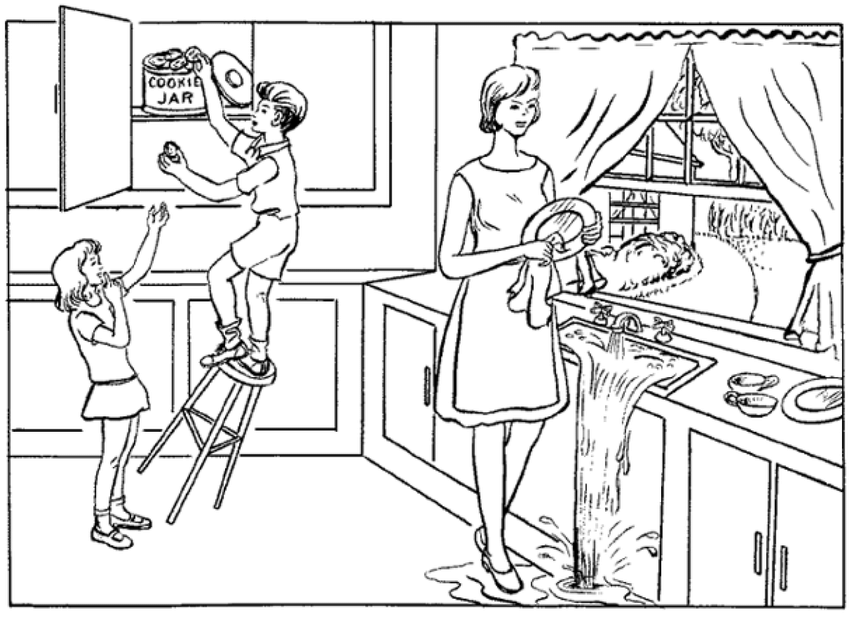
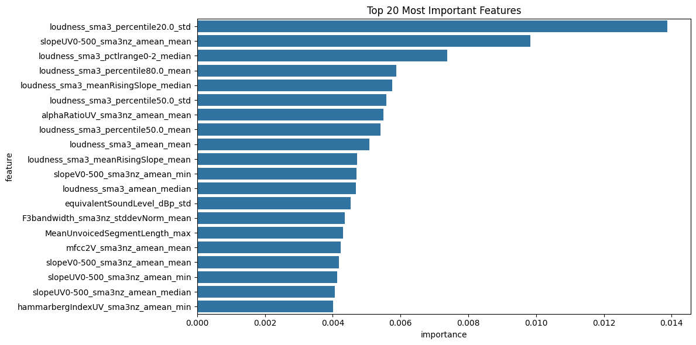

# Alzheimer's Disease Early Detection using Acoustic Biomarkers

## Overview
This project aims to develop models that predict Alzheimer's disease and related dementias (AD/ADRD) using audio recordings. Early detection through vocal features enables timely care and reduces healthcare disparities.

### Why Audio Data?
- **Non-invasive & Cost-effective**: Audio-based screening is simple and affordable.
- **Early Detection**: Speech patterns can reveal cognitive decline, enabling earlier intervention.

---

## Data Description

The dataset includes a picture description task from the Boston Diagnostic Aphasia Examination (Goodglass & Kaplan, 1983), a widely-used diagnostic test for language abnormality detection. In this task, participants describe the "Cookie Theft" picture stimulus while being audio-recorded, with their responses transcribed verbatim.

The dataset consists of audio recordings from 2,058 individuals diagnosed with varying levels of cognitive decline.

### Examples:

**Example 1: Healthy Individual**
- **Audio**: [Listen to audio](gkkg.mp3)
- **Transcription**: _The boy is trying to get water while he's... Am I going too fast? While he's falling off a ladder. And the mother is washing dishes, drying a plate, while the sink is spilling over with water that has overflown from the spigot that is still running. The water is gushing out. And the girl is signaling to be quiet, not to let the mother know that the boy is getting the cooking for her. And I did say that she's drying the dish with the towel, and the water is splashing on the floor._

| UID   | Control | MCI | ADRD |
|-------|---------|-----|------|
| A     |   1     |  0  |  0   |

**Example 2: Individual with ADRD**
- **Audio**: [Listen to audio](eqyg.mp3)
- **Transcription**: _Mother is wiping the dishes. She doesn't seem to think it's even know what's going on. It's I would say summer. It looks like things are growing up. It looks like it's summer. Mother doesn't seem to care what's going on with the kids. There are two cups but only one._

| UID   | Control | MCI | ADRD |
|-------|---------|-----|------|
| B     |   0     |  0  |  1   |

### Key Data Details:
- **Raw Audio Files**: Available via TalkBank.
- **Features**: 88 audio features such as pitch, speech rate, and other voice markers extracted using the OpenSMILE toolkit.

---

## Labels
Possible diagnoses for each individual:
- **Control**: Healthy individual
- **MCI**: Mild Cognitive Impairment (risk of dementia)
- **ADRD**: Advanced decline (e.g., Alzheimer's Disease)

---

## Implementation Overview

### Features:
- Multi-model ensemble approach combining XGBoost, CatBoost, and Random Forest classifiers
- Comprehensive feature engineering from voice recordings
- Cross-validation and performance optimization
- Feature importance analysis across models

This suggests that the most reliable indicators for early Alzheimer's detection in voice are related to:

- Variations in voice loudness
- Changes in voice characteristics over time
- The way someone modulates their voice
- Patterns in speech pauses and continuity

### Technical Implementation

#### Data Processing
- Aggregate features from voice recording segments, incorporate demographic metadata (age, gender)
- Standardize features using StandardScaler
- Generate ensemble-based feature importance rankings

#### Model Architecture
1. **Base Models**:
   - XGBoost Classifier
   - CatBoost Classifier
   - Random Forest Classifier

2. **Ensemble Methods**:
   - Weighted averaging based on model performance
   - Stacking with a logistic regression meta-classifier
   - K-fold cross-validation for robust evaluation

---

## Future Improvements
- Integration of additional voice feature extraction methods
- Development of real-time prediction capabilities
- Enhancement of model interpretability
- Expansion of the audio processing pipeline

